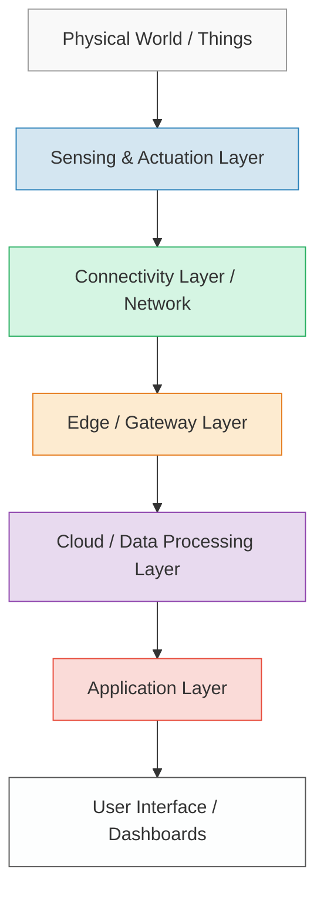
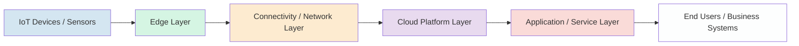
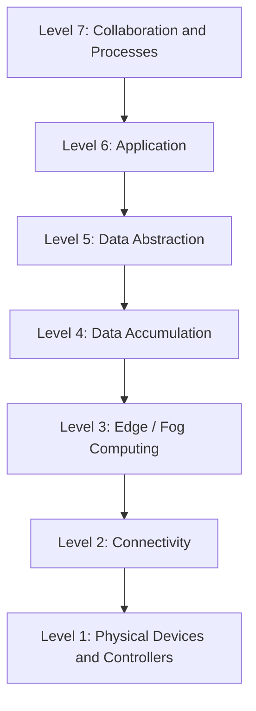
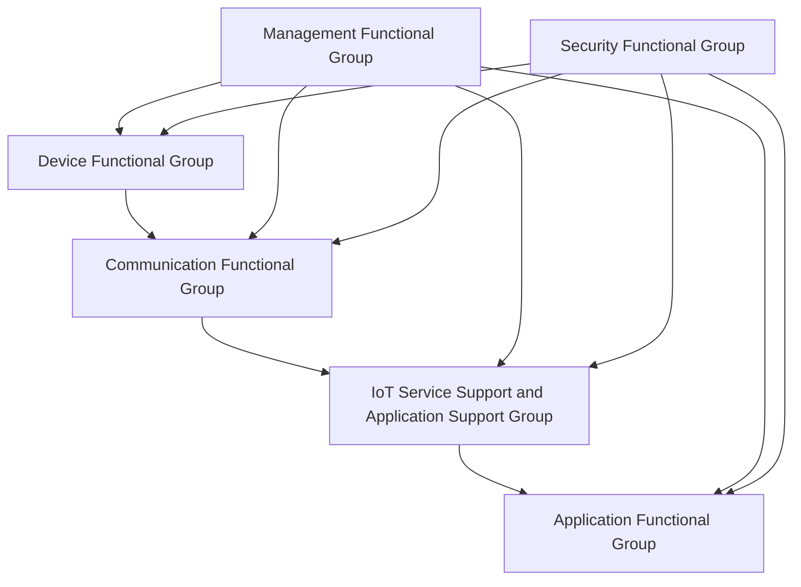
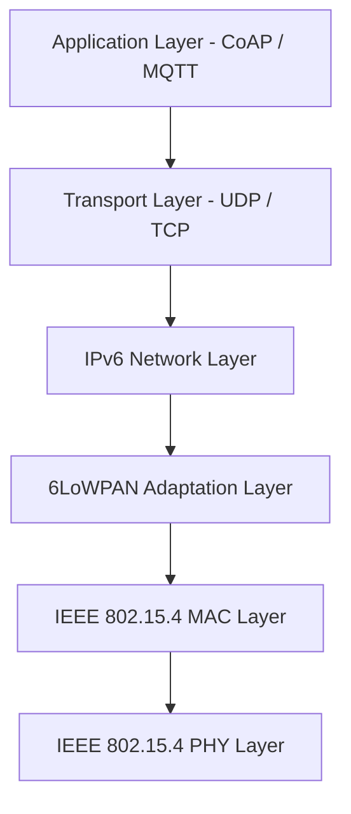
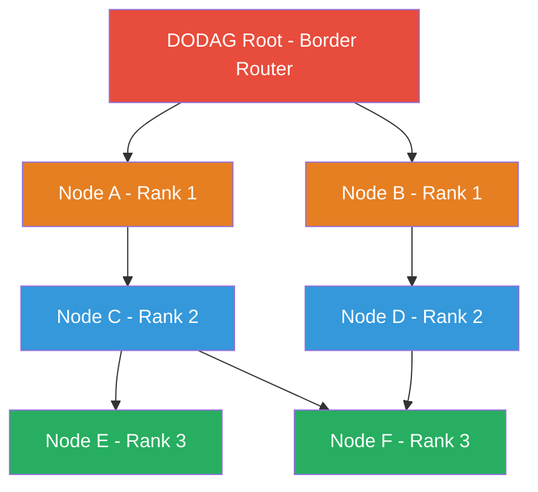

# IoT Complete Study Notes
### Units I, II, and III

---

# UNIT I: OVERVIEW (IoT Fundamentals)

---

## 1. Need for IoT and Its Evolution

The Internet of Things (IoT) refers to connecting everyday physical objects to the internet so they can collect, send, and receive data without human intervention. The need for IoT arose from the growing demand to make devices smarter, improve efficiency, and reduce human effort in managing systems.

### Why IoT is Needed

- Traditional systems required constant human monitoring, which was slow, error-prone, and expensive in large-scale environments like factories or hospitals.
- IoT allows machines to talk to each other and make decisions in real-time, which drastically cuts down response time in critical situations like patient monitoring or industrial safety.
- Energy management became a major concern globally, and IoT helps optimize electricity usage in homes, offices, and industries through smart sensors and automated controls.
- Businesses needed real-time data to make better decisions, and IoT provides a continuous stream of accurate information from the field directly to dashboards and analytics tools.
- As cities grew larger and more complex, managing traffic, waste, water supply, and public safety became impossible manually. IoT enabled smart city solutions that handle these automatically.
- The cost of sensors, microcontrollers, and wireless communication dropped significantly over the years, making it practical and affordable to connect millions of devices to the internet.
- Consumer demand for convenience pushed innovation. People wanted their homes, cars, and wearables to be interconnected and respond intelligently to their habits and needs.

### Evolution of IoT

- **1970s to 1980s:** The concept of connected machines started with SCADA (Supervisory Control and Data Acquisition) systems used in industries to monitor remote equipment over closed networks. These were not internet-connected but laid the foundation.
- **1990:** The first internet-connected appliance was a Coke machine at Carnegie Mellon University. Students connected it to the internet to check if drinks were available and cold before walking to it.
- **1999:** Kevin Ashton first coined the term "Internet of Things" while working at Procter and Gamble. He was promoting RFID (Radio Frequency Identification) for tracking items in supply chains.
- **2000s:** The expansion of Wi-Fi and broadband internet enabled more devices to connect. Home routers became common, and early smart devices like internet-connected cameras and printers entered the market.
- **2008 to 2009:** The number of devices connected to the internet exceeded the number of people on earth. This milestone is often called the official birth of the IoT era.
- **2010s:** Smartphones became the hub for controlling smart home devices. Platforms like Amazon Alexa, Google Home, and Apple HomeKit brought IoT to mainstream consumers.
- **Present Day:** IoT is embedded in healthcare (smartwatches monitoring heart rate), agriculture (soil sensors), logistics (GPS tracking), and manufacturing (predictive maintenance), with billions of connected devices worldwide.

### Real-World Examples

- **Smart Agriculture:** Sensors in fields measure moisture levels and automatically trigger irrigation systems. Farmers receive alerts on their phones if crops are under stress, reducing water usage by up to 30%.
- **Healthcare Wearables:** Devices like Fitbit or Apple Watch monitor heart rate, blood oxygen, and sleep patterns. In hospitals, IoT-enabled beds track patient movements and vitals continuously.
- **Smart Grids:** Electricity companies use IoT sensors on power lines to detect faults, reroute power automatically, and reduce outages. Smart meters at homes send usage data every 15 minutes for accurate billing.
- **Connected Vehicles:** Modern cars use IoT for GPS navigation, automatic emergency braking, remote diagnostics, and over-the-air software updates. Ride-sharing apps rely on IoT for real-time tracking.

---

## 2. Main Design Principles of IoT Architecture

IoT architecture is designed to handle a massive number of devices, diverse communication protocols, real-time data processing, and strong security, all while remaining scalable and interoperable.

- **Scalability:** The system must handle growth gracefully. Whether there are 100 sensors or 10 million, the architecture should scale without needing a complete redesign. Cloud platforms like AWS IoT and Azure IoT Hub are built to auto-scale based on demand.
- **Interoperability:** Devices from different manufacturers must be able to communicate with each other. Standards like MQTT, CoAP, and HTTP ensure that a sensor made by one company can send data to a gateway made by another.
- **Security by Design:** Security is not an afterthought but a core part of the architecture. Every layer, from device firmware to cloud communication, must include authentication, encryption, and access control to prevent unauthorized access.
- **Modularity:** Each component (sensing, communication, processing, storage) should be a separate module. This way, if one part needs an upgrade, you can replace it without rebuilding the entire system.
- **Reliability and Fault Tolerance:** IoT systems often run in critical environments like hospitals or power plants. The architecture must include redundancy, failover mechanisms, and offline operation capabilities so data is not lost during network outages.
- **Low Power Consumption:** Many IoT devices run on batteries for months or years without replacement. The design must prioritize energy efficiency in both hardware and communication protocols (like Zigbee or LoRaWAN which are built for low power use).
- **Real-Time Processing:** Many IoT applications require instant action. Edge computing, where processing happens close to the data source, reduces latency so that a factory floor sensor can trigger an alarm in milliseconds instead of waiting for cloud response.
- **Data Privacy:** IoT devices collect enormous amounts of personal and sensitive data. The architecture must define clear policies on what data is collected, how long it is stored, and who can access it, in compliance with laws like GDPR.

---

## 3. Building Blocks of an IoT System

An IoT system is made up of several key layers and components that work together to collect, transmit, process, and act on data.

### Sensing and Actuation Layer

- This is where the physical world meets the digital world. Sensors collect data like temperature, pressure, light, humidity, motion, or GPS coordinates from the environment.
- Actuators are devices that take action based on commands received. Examples include motors, valves, switches, and speakers.
- Every IoT deployment starts here. Without sensors, there is no data, and without actuators, there is no control.
- Examples include thermostats in smart homes, accelerometers in wearables, and pH sensors in water treatment plants.

### Connectivity Layer

- This layer is responsible for transmitting the data collected by sensors to the next level. It uses various communication technologies depending on range, power, and data requirements.
- Short-range technologies include Wi-Fi, Bluetooth, Zigbee, and Z-Wave. Long-range technologies include LoRaWAN, NB-IoT, and LTE-M for covering large distances with low power.
- The choice of protocol affects battery life, bandwidth, and cost significantly.
- Gateways often serve as the bridge between low-power sensor networks and the internet backbone.

### Edge / Gateway Layer

- Before sending all raw data to the cloud, this layer filters, aggregates, and pre-processes the data locally. This reduces the amount of data that needs to be sent and speeds up response times.
- Gateways handle protocol translation. A Zigbee sensor cannot directly talk to a cloud server, so the gateway converts the Zigbee message to a format the cloud understands.
- Edge computing at this layer allows critical decisions to be made locally without waiting for cloud round trips.
- Hardware examples include Raspberry Pi, industrial routers, and purpose-built IoT gateways.

### Cloud / Data Processing Layer

- The cloud stores vast amounts of historical data and runs complex analytics that edge devices cannot handle. Machine learning models trained here can detect patterns, predict failures, or classify behaviors.
- This layer includes databases (time-series databases like InfluxDB), message brokers (like Kafka or RabbitMQ), and stream processing engines.
- Cloud platforms like AWS IoT Core, Microsoft Azure IoT Hub, and Google Cloud IoT provide managed services for this layer.
- This is where long-term storage, big data analytics, and AI-powered insights are generated.

### Application Layer

- This is the topmost layer that delivers value to end users. It includes dashboards, mobile apps, alert systems, and integration with business software like ERP or CRM systems.
- Developers build applications here using APIs exposed by the cloud layer. Examples include smart home apps, fleet management portals, and industrial monitoring dashboards.
- The application layer also handles user permissions, notifications, and reporting.
- The quality of the user experience depends heavily on how well this layer is designed and how fast it responds to changes in the data.

---

## 4. IoT Capabilities: Sensing, Actuation, and Communication

IoT systems are capable of much more than just connecting devices to the internet. Their core capabilities define how they interact with the physical world and with each other.

### Sensing Capability

- Sensing is the ability to measure physical or environmental conditions using sensors. It is the primary data collection mechanism in any IoT system.
- Temperature sensors, humidity sensors, accelerometers, gyroscopes, pressure sensors, light sensors, GPS modules, and gas detectors are common examples used in IoT applications.
- Sensors can be analog (producing a continuous voltage output) or digital (producing binary data). Digital sensors are easier to interface with microcontrollers directly.
- Advanced sensing includes computer vision using cameras, acoustic sensing using microphones, and chemical sensing using electrochemical cells for environmental monitoring.
- The accuracy and resolution of sensors directly affect the quality of data, and therefore the quality of decisions made by the system.
- In healthcare IoT, biosensors can measure blood glucose, pulse oximetry, ECG signals, and body temperature continuously, replacing periodic manual check-ups with real-time monitoring.

### Actuation Capability

- Actuation is the ability to take physical action in the real world based on a command or a computed decision. It closes the loop between data collection and control.
- Common actuators include electric motors (to move things), solenoid valves (to control fluid flow), relays (to switch electrical circuits), LEDs and displays (to provide visual feedback), and speakers (for audio alerts).
- Actuation can be triggered by pre-defined rules (if temperature exceeds 80 degrees, turn on the fan) or by complex AI decisions (adjust HVAC settings based on predicted occupancy).
- In smart agriculture, actuators connected to irrigation systems open or close water valves based on sensor-measured soil moisture, completely automating watering schedules.
- Industrial robots are a form of advanced actuation where the IoT system directs precise mechanical movements in response to production line data.
- Actuators must be chosen carefully based on the environment. In explosive atmospheres like oil refineries, only intrinsically safe actuators certified for hazardous areas are used.

### Communication Capability

- Communication is the ability of IoT devices to exchange data with each other and with backend systems over wired or wireless networks.
- Device-to-device communication allows sensors and actuators to coordinate directly without going through a central server, reducing latency in time-sensitive applications.
- Device-to-gateway communication is the most common pattern where sensors send their readings to a local gateway that then forwards them to the cloud.
- Gateway-to-cloud communication uses standard internet protocols like MQTT (a lightweight publish-subscribe protocol), AMQP, or HTTPS to send data securely to cloud platforms.
- Communication capabilities include support for addressing (IP addresses, MAC addresses), security (TLS encryption, device certificates), and quality of service (guaranteed delivery, message ordering).
- Protocol selection is based on bandwidth needs, power constraints, distance, and cost. A LoRaWAN sensor in a remote field can transmit small amounts of data over 15 km on a single battery charge, while a Wi-Fi camera inside a home needs high bandwidth but power is always available.

---

## 5. Role of Devices and Gateways in IoT

Devices and gateways form the physical foundation of any IoT deployment. Together they bridge the gap between the physical world and digital networks.

### IoT Devices

- IoT devices are the "things" in the Internet of Things. They are physical objects embedded with sensors, processors, memory, and communication modules that allow them to collect and share data.
- Devices vary enormously in capability. A simple temperature tag might have just a sensor, a small battery, and a basic radio. A smart surveillance camera includes a powerful processor, storage, multiple sensors, and a high-bandwidth Wi-Fi radio.
- Most IoT devices are resource-constrained, meaning they have limited processing power, memory, and energy. This is why specialized low-power protocols and lightweight operating systems like FreeRTOS or Contiki are used on them.
- Devices must be configured with unique identities (device IDs, certificates) so the system can tell them apart, apply appropriate access rules, and trace data back to its exact source.
- Firmware updates must be managed carefully on IoT devices. Over-the-air (OTA) updates allow the manufacturer to push security patches and feature upgrades without physically accessing each device.
- Security vulnerabilities in IoT devices are a major concern. Default passwords, unencrypted communication, and outdated firmware have led to massive botnet attacks like Mirai, which compromised millions of devices in 2016.
- Devices are deployed in a wide range of conditions including extreme heat, moisture, vibration, and electromagnetic interference. Industrial IoT devices are ruggedized with special enclosures to survive these environments.

### IoT Gateways

- A gateway is an intermediate device that sits between IoT end devices and the internet. It collects data from local devices and forwards it to the cloud, acting as a translator and traffic manager.
- Gateways handle protocol conversion. A sensor might communicate over Zigbee or Bluetooth, which cannot directly connect to the internet. The gateway converts this to TCP/IP and forwards it over broadband or cellular.
- Local data processing at the gateway reduces cloud costs and latency. Instead of sending thousands of raw sensor readings per minute, the gateway can compute averages, detect anomalies, and send only meaningful summaries.
- Gateways provide local resilience. If the internet connection goes down, the gateway can buffer data locally and upload it when connectivity is restored, preventing data loss during outages.
- Security enforcement is a key role. Gateways authenticate devices on the local network, encrypt data before sending it to the cloud, and can block unauthorized devices from joining the network.
- Enterprise gateways often run containerized applications, meaning they can run analytics logic, rule engines, and even small machine learning models locally for real-time edge intelligence.
- Examples of commercial IoT gateways include Cisco IR1101, Dell Edge Gateway, and Advantech gateways used in industrial settings.

---

## 6. M2M Communication vs IoT

M2M (Machine-to-Machine) communication is a predecessor to IoT. While they share similarities, they are fundamentally different in scope, architecture, and purpose.

### What is M2M

- M2M refers to direct communication between two machines without human involvement, typically over private or cellular networks. It was widely used in vending machines, ATMs, and utility meter reading before the IoT era.
- M2M systems are often closed, point-to-point setups. A sensor communicates with a specific server, and the two are tightly coupled. There is no open ecosystem.
- M2M relies heavily on cellular networks (2G, 3G) and proprietary protocols that are specific to the vendor and use case.
- The scope of M2M is limited. It focuses on monitoring and reporting, not on complex analytics, machine learning, or interaction between diverse systems.

### What is IoT

- IoT is a broader ecosystem where devices, platforms, apps, and services are interconnected using open standards and internet protocols. It goes far beyond simple machine-to-machine data transfer.
- IoT includes cloud computing, big data analytics, artificial intelligence, and user-facing applications. It turns raw sensor data into actionable insights and automated responses at scale.
- IoT devices are designed to be interoperable, meaning a sensor from one manufacturer can integrate with a platform from another and an app from a third.
- IoT supports bidirectional communication. Not only can devices send data to the cloud, but the cloud can also send commands back to devices. M2M was often one-directional.

### Comparison Table

| Feature | M2M | IoT |
|---|---|---|
| Communication | Point-to-point | Many-to-many, internet-based |
| Network | Private, cellular | Open internet (IP-based) |
| Protocols | Proprietary | Open standards (MQTT, CoAP, HTTP) |
| Scale | Hundreds to thousands | Billions of devices |
| Intelligence | Minimal (report only) | High (analytics, AI, automation) |
| Interoperability | Low (vendor-locked) | High (open ecosystems) |
| Cloud Integration | Rare | Core requirement |
| Human Interaction | Minimal | Strong (apps, dashboards, voice control) |
| Example | Vending machine reporting stock | Smart home with voice assistant and predictive control |

---

## 7. Local Area and Wide Area Networking Technologies in IoT

IoT deployments span different distances and environments, which is why no single networking technology fits all use cases. Different technologies are used based on range, power, bandwidth, and cost requirements.

### Local Area Networking (LAN) Technologies

- **Wi-Fi (IEEE 802.11):** Provides high bandwidth (up to several Gbps in newer versions) and is ideal for IoT devices that need to stream video or transfer large amounts of data. It is commonly used in smart home devices, cameras, and smart speakers. The downside is its relatively high power consumption.
- **Bluetooth and Bluetooth Low Energy (BLE):** Designed for short-range (10 to 100 meters) communication between personal devices. BLE is widely used in wearables, health monitors, and asset tracking tags due to its very low power consumption. It supports a mesh network mode for extended coverage.
- **Zigbee (IEEE 802.15.4):** A low-power, low-data-rate protocol designed for building automation, smart lighting, and home automation. Zigbee devices form mesh networks, so each device can relay messages for others, extending the overall range without increasing power consumption.
- **Z-Wave:** Similar to Zigbee but operates in sub-GHz frequencies (868 MHz in Europe, 908 MHz in the USA), which gives better range and wall penetration. It is mainly used in home automation for door locks, thermostats, and lighting.
- **Thread:** A newer IPv6-based mesh networking protocol designed for smart home devices. It is used in Google Nest products and supports seamless internet connectivity for each device in the mesh.
- **Ethernet (wired LAN):** In industrial IoT where reliability is critical and power is available, wired Ethernet (and its industrial variant, Industrial Ethernet) is still the most reliable option. It offers high throughput, very low latency, and immunity to wireless interference.

### Wide Area Networking (WAN) Technologies

- **LoRaWAN:** A long-range, low-power wide area network protocol. LoRa radios can communicate up to 15 km in rural areas and 2 to 5 km in urban areas on a single battery that can last years. It is ideal for agriculture sensors, smart metering, and environmental monitoring but supports only small data payloads.
- **NB-IoT (Narrowband IoT):** A cellular IoT standard (part of LTE) designed for low-power devices that need nationwide coverage. It uses existing cellular infrastructure, making deployment easy. It is used for smart meters, parking sensors, and asset trackers.
- **LTE-M (LTE for Machines):** Another cellular standard that offers more bandwidth than NB-IoT, making it suitable for mobile IoT applications like vehicle tracking and wearables. It also supports voice and is more responsive than NB-IoT.
- **5G:** The latest cellular standard brings ultra-low latency (under 1 millisecond), extremely high bandwidth, and the ability to connect millions of devices per square kilometer. It enables new IoT applications like autonomous vehicles, remote surgery, and massive industrial automation.
- **Sigfox:** A proprietary LPWAN network that operates in the unlicensed ISM band, offering very low cost per device and global coverage in supported countries. Best for sending tiny amounts of data infrequently, like asset location or alarm events.
- **Satellite IoT:** For truly remote locations with no cellular coverage, satellite networks like Iridium, Inmarsat, and newer constellations like Starlink provide global coverage. Used for monitoring pipelines, ships, wildlife, and remote weather stations.

---

## 8. Data Management in IoT Systems and Its Challenges

IoT systems generate massive volumes of data continuously. Managing this data effectively is critical to extracting value from it.

- **Data Collection and Ingestion:** IoT platforms must handle data arriving from thousands to millions of devices simultaneously. Ingestion pipelines using tools like Apache Kafka or AWS Kinesis buffer and distribute incoming data streams without losing any records even during traffic spikes.
- **Data Storage:** IoT data is often time-series in nature (a value recorded at a specific timestamp). Specialized time-series databases like InfluxDB, TimescaleDB, and AWS Timestream are optimized for storing, querying, and compressing this type of data far more efficiently than traditional relational databases.
- **Data Processing:** Raw sensor data must be cleaned, filtered, and transformed before it is useful. Stream processing frameworks like Apache Flink or Apache Spark Streaming allow real-time analysis of data as it flows in, enabling instant responses to detected conditions.
- **Data Compression and Aggregation:** Storing every single sensor reading forever is impractical and expensive. Older data can be downsampled (aggregated into hourly or daily averages) while keeping high-resolution recent data. This balances storage cost with analytical depth.
- **Data Security and Privacy:** IoT data often includes personal or sensitive operational information. It must be encrypted both in transit (using TLS) and at rest (using database encryption). Access must be controlled so only authorized users and systems can read or modify it.
- **Data Quality Management:** Sensors can malfunction, networks can drop packets, and time clocks can drift. Data pipelines must detect and handle missing values, duplicate readings, out-of-range values, and timestamp errors to prevent corrupted data from reaching analytics systems.

### Key Challenges

- **Volume:** A single oil refinery can generate terabytes of sensor data per day. Storing, indexing, and querying this efficiently requires purpose-built infrastructure.
- **Velocity:** Data arrives in real-time from thousands of devices. The system must process and respond to it at the same speed it arrives, which is technically demanding.
- **Variety:** Devices produce data in different formats, from JSON to binary protocols to CSV files. The data management layer must normalize all of this into a consistent format.
- **Latency:** Some applications like autonomous vehicles need data to be processed in milliseconds. Network latency and processing delays must be minimized through edge computing.
- **Integration:** IoT data often needs to be combined with data from existing enterprise systems like ERP, CRM, and SCADA. Integrating these data sources is complex and requires standardized APIs.
- **Ownership and Governance:** When IoT devices are deployed in shared or public spaces, questions arise about who owns the data, who is responsible for it, and how long it should be retained.

---

## 9. Business Processes in IoT

IoT does not just collect data; it transforms how businesses operate by automating workflows, improving visibility, and enabling new service models.

- **Process Automation:** IoT enables business processes to trigger automatically based on real-world events. In a warehouse, when an RFID scan detects that inventory of a product has fallen below the reorder threshold, a purchase order can be automatically raised in the ERP system without human intervention.
- **Real-Time Visibility:** Businesses gain a live view of their operations. A logistics company can track every vehicle in its fleet on a map, know delivery status in real-time, and automatically notify customers when their package is 10 minutes away.
- **Predictive Maintenance:** Instead of servicing machines on a fixed schedule (which wastes money if the machine is fine) or after failure (which is costly and disruptive), IoT enables condition-based maintenance. Vibration sensors and thermal cameras detect early signs of wear, and the system schedules maintenance only when needed.
- **Customer Experience Enhancement:** Retail stores use IoT beacons to send personalized offers to customers' smartphones as they walk past specific product sections. Hotels use IoT to let guests control room temperature, lighting, and curtains from their phones before they even arrive.
- **Safety and Compliance:** In chemical plants, IoT gas detectors and safety interlocks automatically shut down processes if dangerous conditions are detected, protecting workers and ensuring regulatory compliance without relying on manual inspection.
- **New Business Models:** IoT enables "servitization," where companies sell outcomes instead of products. A pump manufacturer no longer just sells pumps; it sells "uptime hours" by continuously monitoring its pumps at customer sites and guaranteeing performance with remote maintenance included.

### Real-World Example: Smart Manufacturing

Consider an automobile manufacturing plant using IoT to manage its production line:

- **Sensing:** Sensors on every machine measure temperature, vibration, output speed, and energy consumption every second.
- **Connectivity:** Data is transmitted over industrial Ethernet to an edge server on the factory floor.
- **Analytics:** The edge server runs an anomaly detection model that flags when a machine's behavior deviates from normal patterns.
- **Action:** When an anomaly is detected, a work order is automatically created in the maintenance management system, a technician is notified via mobile app, and production is rerouted to a backup machine to avoid downtime.
- **Business Outcome:** Unplanned downtime drops by 40%, maintenance costs fall by 25%, and production efficiency increases because resources are used optimally.
- **Reporting:** Managers see live dashboards showing Overall Equipment Effectiveness (OEE) for each machine and receive weekly AI-generated reports highlighting trends and recommendations.

---

## 10. Everything as a Service (XaaS) in the Context of IoT

XaaS (Everything as a Service) is a cloud computing model where services are delivered over the internet on demand rather than being installed locally. In IoT, XaaS eliminates the need for organizations to build and manage their own IoT infrastructure.

- **Infrastructure as a Service (IaaS):** Cloud providers like AWS, Azure, and Google Cloud offer the physical computing, storage, and networking infrastructure needed to run IoT platforms. Companies rent what they need and scale up or down based on usage, avoiding the capital expense of buying servers.
- **Platform as a Service (PaaS):** IoT-specific platforms like AWS IoT Core, Azure IoT Hub, and Google Cloud IoT provide ready-made services for device management, data ingestion, rules engines, and integration. Developers can build IoT applications without managing the underlying infrastructure.
- **Software as a Service (SaaS):** Fully built IoT applications delivered over the internet as a subscription. Examples include fleet management software, smart building management platforms, and agricultural monitoring dashboards that businesses can use immediately without any development.
- **Device as a Service (DaaS):** Some vendors provide IoT hardware (sensors, gateways, routers) bundled with management software and support as a monthly subscription. This means businesses get the physical devices, connectivity, and cloud management platform in one package.
- **Analytics as a Service (AaaS):** Specialized analytics platforms provide IoT data visualization, anomaly detection, and machine learning capabilities without requiring data science expertise in-house. Examples include Splunk, ThingSpeak, and IBM Watson IoT Analytics.
- **Connectivity as a Service (CaaS):** Telecom operators and MVNO (Mobile Virtual Network Operators) provide managed IoT connectivity, including SIM cards, network management, and global roaming for IoT devices, billed per device per month.
- **Security as a Service (SECaaS):** Given the massive security challenges in IoT, vendors offer cloud-based security services including device identity management, certificate lifecycle management, threat detection, and vulnerability scanning as subscriptions.
- **Benefits of XaaS in IoT:** Companies can start small and scale without upfront capital investment, benefit from continuous updates and improvements made by the platform provider, and focus their internal teams on building IoT applications and business logic rather than managing infrastructure.

---

## 11. IoT Analytics and Its Importance in Decision Making

IoT analytics refers to the collection, processing, and analysis of data generated by IoT devices to derive meaningful insights and enable better decisions.

- **Descriptive Analytics:** The most basic form. It tells you what happened. Dashboards showing current and historical sensor values, alerts when thresholds are crossed, and trend graphs all fall under descriptive analytics. It gives operators situational awareness.
- **Diagnostic Analytics:** Goes deeper to explain why something happened. If a machine's temperature spiked, diagnostic analytics correlates it with other data points (speed, load, coolant pressure) to identify the root cause. It is essential for post-incident investigation.
- **Predictive Analytics:** Uses historical patterns and machine learning to forecast future events. A predictive maintenance model trained on years of sensor data can predict with high accuracy when a bearing is likely to fail, days or weeks in advance.
- **Prescriptive Analytics:** The most advanced form. Not only does it predict what will happen, it also recommends the best action to take. An energy management system might say "based on tomorrow's weather forecast and occupancy pattern, reduce HVAC power at 3 PM to save 15% energy."
- **Real-Time Stream Analytics:** In applications like fraud detection, autonomous vehicles, or emergency response, analytics must happen on data as it streams in, not on stored historical data. Technologies like Apache Flink, AWS Kinesis Analytics, and Azure Stream Analytics enable this.
- **Edge Analytics:** Running analytics models directly on gateways or devices reduces the need to send all raw data to the cloud. A camera with an embedded AI chip can detect a defective product on a conveyor belt and reject it instantly without involving the cloud.
- **Importance in Decision Making:** IoT analytics transforms raw machine data into business decisions. A supermarket chain using IoT temperature sensors in refrigerators combined with analytics can predict compressor failure 48 hours in advance, schedule a repair at a quiet time, and prevent thousands of dollars of food spoilage and lost sales.
- **Anomaly Detection:** One of the most common analytics use cases in IoT. Algorithms learn the normal behavior of a system and raise alerts when deviations occur, catching issues that fixed-threshold rules would miss entirely.

---

## 12. Knowledge Management in IoT

Knowledge management in IoT involves capturing, organizing, and using the insights derived from IoT data to improve processes, products, and decision-making over time.

- **Knowledge Capture:** IoT systems continuously generate operational data. Knowledge management frameworks ensure this data is not just stored but converted into reusable knowledge, such as maintenance procedures derived from failure patterns, or energy efficiency recipes derived from building sensor data.
- **Ontologies and Semantic Models:** To make sense of data from diverse devices and systems, ontologies define the relationships between entities (a "pump" belongs to a "system" which is part of a "plant"). Standards like W3C's SSN (Semantic Sensor Network) ontology allow IoT data to be interpreted in context.
- **Machine Learning as a Knowledge Tool:** ML models trained on IoT data encode patterns and relationships that humans might never spot manually. These models represent a form of machine-held knowledge that can be applied automatically in real-time to new data streams.
- **Knowledge Sharing Across Systems:** IoT platforms with open APIs allow insights from one system to inform another. A smart building's knowledge about occupancy patterns can be shared with the HVAC system to pre-condition rooms before people arrive, and with the access control system to flag unusual after-hours presence.
- **Feedback Loops:** When IoT systems act on knowledge and observe the results, they create feedback loops. If a predictive model recommends a maintenance action and the outcome confirms the prediction, that data enriches the model further, making it more accurate over time.
- **Human-Machine Knowledge Integration:** Experienced technicians and operators hold tacit knowledge about how systems behave. IoT knowledge management platforms can capture this through annotations (a technician notes in the system what caused a specific anomaly), creating a combined knowledge base of machine data and human expertise.
- **Standards and Interoperability:** Open standards like FIWARE NGSI-LD, SAREF ontology, and oneM2M ensure that knowledge encoded in one IoT platform can be understood and used by another, preventing knowledge silos.
- **Applications:** In a smart hospital, IoT knowledge management captures patterns in patient data, equipment usage, and staff workflows. Over time, the system knows that certain equipment failure patterns precede patient deterioration events, enabling proactive intervention protocols.

---

---

# UNIT II: ARCHITECTURE

---

## 1. State-of-the-Art IoT Architecture and Its Components

Modern IoT architecture has evolved from simple two-tier (device-to-server) systems to sophisticated multi-layer platforms that support billions of diverse devices, edge computing, and AI-driven automation.

- **Device Layer:** This is the hardware layer consisting of sensors, actuators, embedded processors, and communication modules. Devices are typically resource-constrained and run lightweight firmware. Modern devices support multiple communication interfaces (Bluetooth + Wi-Fi + cellular) for flexibility.
- **Edge Layer:** Processing happens close to the data source. Edge servers, industrial PCs, and smart gateways run containerized applications, rule engines, and AI inference models. This reduces latency and cloud data costs significantly.
- **Connectivity Layer:** The network fabric connecting all components. It may include multiple technologies simultaneously, such as cellular (NB-IoT, LTE-M), LPWAN (LoRaWAN, Sigfox), Wi-Fi, and Ethernet, chosen based on device requirements.
- **Cloud Platform Layer:** The backbone of IoT operations at scale. Includes IoT brokers (MQTT brokers), device registries (which maintain the inventory and state of all connected devices), data ingestion pipelines, storage systems, and analytics engines. AWS IoT Core, Azure IoT Hub, and Google Cloud IoT are commercial examples.
- **Application Layer:** Business-specific applications built on top of the cloud platform. These may be web apps, mobile apps, ERP integrations, or automated workflows. REST APIs and GraphQL interfaces expose IoT data and commands to application developers.
- **Security Fabric:** Security is a cross-cutting concern that spans every layer. It includes hardware security modules (HSMs) for key storage in devices, TLS encryption for all communications, identity and access management (IAM) in the cloud, and security monitoring systems that detect anomalies and intrusions.
- **Management and Orchestration:** Device lifecycle management handles provisioning new devices, pushing firmware updates, monitoring device health, and decommissioning old devices. Orchestration platforms like Kubernetes manage containerized edge applications.
- **Digital Twin Integration:** Modern IoT architectures maintain a digital twin of every physical asset, which is a virtual real-time replica that reflects the current state of the device. This enables simulation, testing, and predictive analysis without touching the physical asset.

---

## 2. IoT Reference Model in Detail

The IoT Reference Model is a standardized layered model developed by Cisco, IBM, and other industry leaders to provide a common framework for designing IoT systems. It defines seven levels.

- **Level 1 (Physical Devices and Controllers):** The hardware foundation. Includes all sensors, actuators, machines, and embedded systems that interact with the physical world. Devices here range from a tiny temperature sensor to a massive industrial robot.
- **Level 2 (Connectivity):** Handles reliable, secure communication between devices and the network. Includes network switches, routers, gateways, and the communication protocols (Zigbee, Wi-Fi, Ethernet, cellular) used to move data from Level 1 upward.
- **Level 3 (Edge / Fog Computing):** Data from multiple devices is analyzed locally before being sent to the cloud. This layer performs filtering (discarding irrelevant data), formatting (converting proprietary formats to standard ones), and basic analytics. It is what makes near-real-time responses possible.
- **Level 4 (Data Accumulation):** Data that has been pre-processed at the edge is stored here for access by higher layers. Both volatile (in-memory, real-time) and non-volatile (disk-based, persistent) storage are used. This level converts streaming data into queryable data at rest.
- **Level 5 (Data Abstraction):** Multiple data sources are reconciled and presented in a unified way. This layer handles data normalization, semantic enrichment, and schema consolidation so that applications above do not need to worry about the diverse formats of raw device data.
- **Level 6 (Application):** Business intelligence and applications consume the processed data. Monitoring dashboards, analytics platforms, control applications, and reporting systems live at this level. This is where human insight meets machine data.
- **Level 7 (Collaboration and Processes):** The highest level where business processes, people, and external systems interact with the IoT system. It involves integrating IoT data with enterprise workflows, enabling cross-organizational data sharing, and defining how insights translate into business actions.

---

## 3. IoT Reference Architecture with All Architectural Views

The IoT Reference Architecture (IoT-RA) developed under frameworks like oneM2M and ISO/IEC 30141 provides a multi-view description of how IoT systems should be structured. Each view addresses the concerns of a specific stakeholder group.

- **Business View:** Addresses the business objectives, policies, processes, and organizational roles involved in the IoT deployment. It identifies what problems the IoT system is solving, who the stakeholders are, and what regulatory or business constraints apply. This view drives all other architectural decisions.
- **Usage View (Use Case View):** Captures the scenarios in which the system will be used, the actors involved (users, administrators, external systems), and the flows of interaction. Use cases like "monitor building energy usage" or "track cold chain temperature" are described here.
- **Functional View:** Describes what the system does by defining functional components and their responsibilities. This is about logical functions like "device management," "data collection," "event processing," and "identity management," without specifying how they are implemented.
- **Information View:** Focuses on the data that flows through the system. It defines data models, data lifecycles, how data is structured and tagged, and how it moves between components. This view ensures that data produced by one component is understandable by another.
- **Deployment View:** Describes where and how the system components are physically or logically deployed. It specifies which functions run on devices, which run on gateways, and which run in the cloud. It also covers deployment environments (industrial, home, urban) and their constraints.
- **Communication View:** Defines the communication protocols and patterns used between components. It specifies which protocols are used at each layer (e.g., Zigbee at the device level, MQTT at the edge-to-cloud level, HTTPS at the application level) and how devices are identified and addressed.
- **Security View:** Addresses threats and countermeasures across all other views. It defines authentication mechanisms, encryption standards, key management practices, audit logging requirements, and privacy controls applied throughout the system.
- **Operational View:** Covers how the system is managed, monitored, and maintained throughout its lifecycle. Device provisioning, OTA firmware updates, health monitoring, troubleshooting procedures, and decommissioning processes are all part of this view.

---

## 4. Functional View of IoT Architecture

The functional view describes the system in terms of what functions it performs, organized into logical groups called functional domains or components.

- **Device Functional Group:** Contains the functions for interaction with the physical world. This includes sensing functions (reading sensor values), actuation functions (sending commands to actuators), device self-management functions (monitoring own health and battery level), and device communication functions (preparing and sending data).
- **Communication Functional Group:** Handles the transport of data between devices, gateways, and the cloud. Functions include protocol adaptation, message routing, quality of service management (ensuring critical messages are delivered reliably), and network address management.
- **IoT Service Support and Application Support Group:** Provides common horizontal services that all IoT applications can use, including device registration, data storage, semantic processing, subscription and notification services, and security services. This is the "platform" layer.
- **Application Functional Group:** Contains the actual IoT application logic. Smart home control, industrial monitoring, healthcare monitoring, and logistics tracking are all applications that sit in this group. They consume services from the support layer through standardized APIs.
- **Management Functional Group:** Provides lifecycle management functions for all components. This includes configuration management, fault management (detecting and recovering from errors), performance monitoring, device software management (firmware updates), and network management.
- **Security Functional Group:** A horizontal function that applies across all other groups. It includes authorization (who can do what), authentication (verifying identity), data confidentiality (encryption), data integrity (detecting tampering), and privacy protection.

---

## 5. Information View and Deployment View of IoT Systems

### Information View

- The information view defines the structure, semantics, flow, and lifecycle of information within the IoT system. It answers the question: what data exists in the system, where does it come from, where does it go, and what does it mean?
- **Data Models:** Raw sensor readings, events, device metadata, commands, and aggregated reports each have their own data models. Standards like FIWARE NGSI-LD and W3C's SOSA/SSN ontology define common data models so different systems can understand each other's data.
- **Data Lifecycle:** Data moves through stages: collection (raw reading from sensor), processing (filtered, normalized, enriched), storage (persisted in a database), analysis (queried and analyzed), presentation (shown on a dashboard), and archival or deletion (retired after retention period expires).
- **Information Flows:** The information view maps out who sends what data to whom. A temperature sensor sends raw readings to an edge gateway, which computes hourly averages and sends them to a cloud database, which feeds a visualization dashboard that an operator views.
- **Data Quality and Consistency:** The information view defines rules for handling incomplete, duplicate, or conflicting data from multiple sources. It ensures that when two sensors report different values for the same measurement, the system resolves the conflict predictably.
- **Metadata Management:** Contextual information about data (the location of a sensor, its calibration date, its accuracy specification) is as important as the data itself. The information view defines how metadata is attached to data and maintained throughout its lifecycle.

### Deployment View

- The deployment view shows how the logical components of the IoT architecture are physically distributed across hardware resources, network segments, and geographic locations.
- **Device Tier Deployment:** Sensors and actuators are deployed at the point of measurement or control. In a smart building, temperature sensors are distributed across all floors and rooms. Their deployment density and placement are governed by physical constraints and coverage requirements.
- **Edge Tier Deployment:** Gateways and edge servers are deployed close to device clusters to minimize communication distance. In a factory, an edge server might serve a single production line. In smart city deployment, edge nodes might be mounted on street poles.
- **Cloud Tier Deployment:** Cloud services are deployed in data centers, often in multiple regions for redundancy and to comply with data residency laws (some countries require certain data to stay within their borders).
- **Hybrid Deployment:** In practice, IoT systems use a combination of cloud, edge, and on-premises deployment. Critical real-time functions run at the edge, while historical analytics and AI training run in the cloud, and regulatory compliance data is kept on-premises.
- **Network Topology:** The deployment view also describes the network topology, including which devices connect to which gateways, how gateways connect to the internet, and how the cloud platform is structured (microservices, availability zones, CDN for API endpoints).
- **Environmental Constraints:** The deployment view accounts for the physical environment. Industrial deployments must specify IP (Ingress Protection) ratings for enclosures. Outdoor deployments must consider temperature ranges, waterproofing, lightning protection, and vandal resistance.

---

## 6. Real-World Design Constraints in IoT

When designing IoT systems, engineers face a range of real-world constraints that force trade-offs between ideal functionality and practical feasibility.

- **Power Supply Limitations:** Many IoT devices are battery-powered and must last months or years without replacement, especially in remote or hard-to-access locations. This forces designers to use low-power microcontrollers, duty-cycled radios (transmitting only briefly then going to sleep), and energy harvesting (solar, vibration, thermal) where possible.
- **Connectivity Reliability:** IoT devices often operate in environments with intermittent or poor network coverage, such as underground, in rural areas, or inside metal enclosures. Designs must include local data buffering, store-and-forward mechanisms, and automatic reconnection logic.
- **Physical Environment Extremes:** A sensor on an oil rig must withstand saltwater corrosion, extreme temperatures, and explosive atmospheres. A sensor in a hospital must be sterilizable and EMI-compliant. Every deployment environment imposes specific hardware and enclosure requirements that significantly affect design choices.
- **Cost Constraints:** In large-scale IoT deployments with millions of devices, even a one-dollar reduction in unit cost saves millions of dollars. This pushes designers toward minimal hardware specs, shared platforms, and choosing the cheapest communication technology that meets the requirements.
- **Regulatory and Compliance Requirements:** IoT devices using radio frequencies must be certified by regulatory bodies (FCC in the USA, CE in Europe). Healthcare IoT devices need FDA clearance. Medical and industrial IoT must comply with ISO and IEC standards. These constraints affect both design and time-to-market.
- **Security vs. Usability Trade-off:** Strong security (frequent certificate rotation, complex authentication, encrypted storage) consumes processor resources and power on constrained devices. Designers must balance meaningful security with the device's ability to function within its resource limits.
- **Scalability and Future-Proofing:** IoT deployments last years or decades. Hardware designed today must be capable of running software updates that add new features or fix security issues discovered years later. This requires adequate flash memory, processing headroom, and secure boot capabilities.
- **Legacy System Integration:** Many IoT projects involve connecting new sensors and devices to existing legacy systems that use old protocols and interfaces. The IoT architecture must accommodate this without requiring a complete replacement of the legacy infrastructure.

---

## 7. Technical Design Constraints in IoT Hardware

Beyond real-world operational constraints, there are specific technical limitations at the hardware design level that every IoT hardware engineer must navigate.

- **Processing Power vs. Power Consumption:** More powerful processors consume more energy. IoT hardware designers choose the minimum processor capability needed for the task. Microcontrollers like ARM Cortex-M0 or M4 are common choices because they offer sufficient performance at very low power draw.
- **Memory Limitations:** IoT microcontrollers typically have kilobytes (not gigabytes) of RAM and flash storage. Code must be written efficiently, data structures must be compact, and firmware update mechanisms must work within these tiny memory footprints.
- **Clock Accuracy:** Many IoT applications rely on accurate timestamps for data correlation across devices. Crystal oscillators are affected by temperature drift, which causes clocks to diverge. Hardware designs must either include temperature-compensated oscillators or synchronize time regularly using NTP (Network Time Protocol).
- **Radio Frequency (RF) Design:** Antenna placement, PCB layout, and impedance matching critically affect the wireless range and reliability of an IoT device. A poorly designed antenna can reduce communication range by 90%. Compact IoT devices make RF design especially challenging because the antenna is close to the metal enclosure and battery.
- **EMI/EMC Compliance:** IoT hardware must not emit electromagnetic interference that would disrupt other devices, and must not be disrupted by EMI from its environment. Meeting EMC standards requires careful PCB design, filtering, and shielding, which adds cost and complexity.
- **Temperature Range:** Consumer-grade components are typically rated for 0 to 70 degrees Celsius. Industrial IoT devices must often operate from minus 40 to plus 85 degrees Celsius. This requires industrial-grade components that are more expensive and sometimes harder to source.
- **Connector and Form Factor Constraints:** In wearable or implantable medical IoT devices, the entire device must fit within millimeters. This requires custom PCBs, integrated antennas, and miniaturized batteries that significantly constrain the designer's component options.
- **Hardware Security:** Physical access to a device is a real threat. Hardware security features like secure boot (ensuring only signed firmware runs), hardware-backed key storage (TPM chips or ARM TrustZone), and tamper detection circuits are technical design elements that add security but also cost and complexity.

---

## 8. Data Representation and Visualization Techniques in IoT

Data representation defines how IoT data is structured and formatted. Visualization translates this data into human-understandable displays.

### Data Representation

- **JSON (JavaScript Object Notation):** The most widely used format for IoT data because it is human-readable, easy to parse, and supported by virtually every programming language and platform. A temperature reading might look like {"deviceId": "sensor01", "temp": 23.5, "unit": "C", "timestamp": "2024-01-15T10:30:00Z"}.
- **XML:** A more verbose alternative to JSON, still used in legacy IoT systems and enterprise integrations. It supports schemas for strict validation of data structure.
- **CBOR (Concise Binary Object Representation):** A binary version of JSON designed for constrained IoT devices. It encodes the same information as JSON but in a fraction of the bytes, making it ideal for low-bandwidth, low-power networks like LoRaWAN.
- **Protobuf (Protocol Buffers):** A binary serialization format from Google. Faster to encode/decode than JSON and much more compact. Used in high-throughput IoT systems where processing speed matters.
- **SenML (Sensor Measurement Lists):** An IETF standard specifically for representing simple sensor measurements and actuator states. Designed for IoT, it is efficient and includes standardized unit definitions.
- **RDF and Linked Data:** For semantic IoT systems, data is represented as RDF (Resource Description Framework) triples that encode meaning and relationships, enabling AI systems to reason about the data rather than just store it.

### Visualization Techniques

- **Time-Series Line Charts:** The most common IoT visualization. Sensor values are plotted against time to show trends, cycles, and anomalies. Perfect for temperature, pressure, energy consumption, and any continuously varying measurement.
- **Gauge and Dial Charts:** Show current values relative to acceptable ranges. Used in real-time monitoring dashboards to quickly communicate whether a value is in the normal (green), warning (yellow), or critical (red) zone.
- **Heatmaps:** Show the distribution of values across a 2D space. A building energy heatmap shows which rooms consume the most electricity. A network heatmap shows traffic density across nodes.
- **Geo-Maps:** Show the location and status of IoT devices on a geographic map. Essential for fleet tracking, infrastructure monitoring, and smart city applications.
- **Histograms and Distribution Charts:** Show the statistical distribution of sensor values over time. Useful for quality control in manufacturing to show how many products fall within and outside specifications.
- **Sankey and Flow Diagrams:** Show the flow of energy, water, materials, or data through a system. Used in smart grid management and industrial process monitoring.
- **Alerts and Notification Panels:** Visual flags that draw attention to conditions requiring human action. Good dashboards use color coding, priority ordering, and contextual information to help operators quickly triage issues.

---

## 9. Interaction and Remote Control Mechanisms in IoT Applications

IoT systems are not just about collecting data; they also need mechanisms for humans and other systems to send commands back to devices.

- **RESTful APIs:** The most common interaction mechanism for cloud-to-device and app-to-platform communication. REST APIs use standard HTTP methods (GET to read state, POST to send a command, PUT to update configuration, DELETE to remove a device). They are well-understood, easy to secure, and supported by every programming language.
- **MQTT Command Topics:** In MQTT-based systems, commands are sent by publishing messages to specific "command topics" that the device subscribes to. The device listens for messages on its command topic and executes the action described. This is a bidirectional use of the publish-subscribe pattern.
- **CoAP (Constrained Application Protocol):** Designed for constrained devices that cannot run full HTTP stacks. CoAP is a lightweight request-response protocol similar to HTTP but optimized for low-power networks. It supports both direct device requests and observe mode (where a client subscribes to receive updates when a resource changes).
- **Digital Twin Interaction:** In modern IoT platforms, users interact with a device's digital twin (its virtual representation in the cloud) rather than the device directly. The platform handles synchronizing commands to the physical device. AWS IoT Device Shadow and Azure IoT Device Twin implement this pattern.
- **Voice and Natural Language Control:** Smart home and consumer IoT devices increasingly support voice commands through assistants like Amazon Alexa, Google Assistant, and Apple Siri. Natural language processing converts spoken commands into API calls that control devices.
- **Mobile and Web Applications:** User-facing apps provide graphical interfaces for controlling devices. A homeowner adjusts thermostat settings through a mobile app. A factory manager starts a production job from a web dashboard. These apps communicate with IoT platforms through secure APIs.
- **Automated Rules and Workflows:** Interaction does not always require a human. Rule engines in IoT platforms (like AWS IoT Rules or Node-RED) automatically send commands to devices when specific conditions are met. "If motion is detected after 10 PM, turn on lights and send a notification" is an automated interaction rule.
- **Remote Firmware and Configuration Updates:** OTA (Over-the-Air) updates allow platform administrators to push new firmware or configuration to thousands of devices simultaneously. This is a critical interaction mechanism for maintaining security and functionality over the device's lifetime.

---

---

# UNIT III: IoT DATA LINK AND NETWORK LAYER PROTOCOLS

---

## 1. PHY and MAC Layer Technologies Used in IoT

The Physical (PHY) and Medium Access Control (MAC) layers are the two lowest layers in the network stack. They define how bits are transmitted over the air and how multiple devices share the same wireless medium.

### Physical (PHY) Layer

- The PHY layer is responsible for the actual transmission of raw bits over a physical medium (radio waves, light, electrical signals). It defines modulation schemes, operating frequencies, data rates, and transmission power levels.
- Modulation techniques used in IoT include FSK (Frequency Shift Keying) for Bluetooth and Zigbee, CSS (Chirp Spread Spectrum) for LoRa which gives excellent range and noise immunity, and OFDM (Orthogonal Frequency Division Multiplexing) for Wi-Fi which gives high data rates.
- The ISM (Industrial, Scientific, and Medical) bands are unlicensed frequency bands widely used by IoT. The 2.4 GHz band is used by Wi-Fi, Bluetooth, and Zigbee. The 915 MHz (USA) and 868 MHz (Europe) sub-GHz bands are used by LoRa, Z-Wave, and Sigfox for better range and wall penetration.
- PHY layer design must balance sensitivity (ability to detect weak signals), selectivity (ability to reject interference), and output power (transmission range) while keeping energy consumption within the device's budget.
- Spread spectrum techniques like DSSS (Direct Sequence Spread Spectrum) used in 802.11b and FHSS (Frequency Hopping Spread Spectrum) used in Bluetooth improve resistance to interference and multipath fading.
- In LPWAN systems, the PHY layer is specifically optimized for long range at the cost of data rate. LoRa chips achieve ranges of 15 km in rural areas using just 25 mW of transmit power.
- Receive sensitivity is a key PHY metric. LoRa achieves minus 137 dBm sensitivity (can detect an incredibly faint signal), compared to minus 95 dBm for standard Wi-Fi, explaining its dramatically better range.

### MAC Layer

- The MAC sublayer controls how devices access the shared wireless medium. Since multiple devices sharing the same radio channel would cause collisions (simultaneous transmissions that destroy each other), the MAC layer manages who gets to transmit and when.
- CSMA/CA (Carrier Sense Multiple Access with Collision Avoidance) is used by Wi-Fi (802.11) and Zigbee (802.15.4). Devices listen before transmitting. If the channel is busy, they wait a random backoff time before trying again, reducing the probability of collision.
- TDMA (Time Division Multiple Access) divides time into fixed slots and assigns specific slots to specific devices. This deterministic approach eliminates collisions and is used in industrial IoT protocols like WirelessHART and 802.15.4e (TSCH) for predictable, reliable communication.
- Beacon-based MAC protocols (used in Zigbee and IEEE 802.15.4) allow devices to sleep between beacon intervals, waking only briefly to receive beacons and then either receive their data or go back to sleep. This dramatically reduces power consumption.
- The MAC layer also handles frame formatting (adding headers, payload, and checksum to data), link-layer addressing (using 64-bit EUI-64 or 16-bit short addresses in 802.15.4), and link-layer acknowledgment (confirming successful frame reception).
- ALOHA-based MAC (used in LoRaWAN Class A) is the simplest approach: devices transmit whenever they have data without checking first. Collisions are handled by retransmission. It is extremely simple and power-efficient but only works well at low channel utilization.
- MAC layer security in 802.15.4 includes AES-128 encryption and message integrity codes (MIC) applied to each frame, protecting against eavesdropping and message tampering at the link layer.

---

## 2. Comparison of IEEE 802.11 and IEEE 802.15 Standards for IoT

| Feature | IEEE 802.11 (Wi-Fi) | IEEE 802.15.4 (Zigbee/LoWPAN basis) |
|---|---|---|
| Primary Purpose | High-speed wireless LAN | Low-rate wireless personal area network |
| Typical Data Rate | 54 Mbps to several Gbps | 20 kbps to 250 kbps |
| Typical Range | 50 to 100 meters indoors | 10 to 100 meters |
| Frequency Band | 2.4 GHz and 5 GHz | 2.4 GHz (global), 868/915 MHz |
| Power Consumption | High (unsuitable for battery-only devices) | Very low (years on coin cells possible) |
| Topology | Star (infrastructure or ad-hoc) | Star, tree, or mesh |
| MAC Protocol | CSMA/CA | CSMA/CA or TDMA (TSCH mode) |
| Security | WPA2/WPA3 | AES-128 at link layer |
| Network Size | Tens to hundreds of nodes per AP | Up to 65,000 nodes per network |
| Latency | Low (a few ms) | Low to moderate (depends on duty cycle) |
| Use in IoT | High-bandwidth devices (cameras, smart TVs, hubs) | Sensor networks, building automation, smart metering |
| IP Support | Native IPv4/IPv6 | IPv6 via 6LoWPAN adaptation layer |
| Standard Body | IEEE 802.11 Working Group | IEEE 802.15.4 Working Group |
| Protocol Built On It | Direct TCP/IP | Zigbee, Thread, 6LoWPAN, WirelessHART |

---

## 3. WirelessHART, Z-Wave, and Bluetooth Low Energy

### WirelessHART

- WirelessHART is an industrial wireless sensor networking technology based on the HART (Highway Addressable Remote Transducer) protocol, extended to support wireless mesh networking. It operates in the 2.4 GHz band using IEEE 802.15.4 physical layer.
- It uses Time Synchronized Mesh Protocol (TSMP), meaning all devices are synchronized to a common time base and transmit in pre-assigned time slots. This eliminates collisions and guarantees deterministic, predictable communication latency.
- The protocol uses channel hopping, changing the radio channel with each transmission. This makes it immune to interference from Wi-Fi and other 2.4 GHz devices in the industrial environment.
- WirelessHART supports redundant paths through the mesh. If one node fails, data is automatically rerouted through alternative paths, giving it the high reliability required for industrial process control.
- It is widely deployed in oil refineries, chemical plants, and water treatment facilities for monitoring pressure, temperature, flow, and level sensors in locations where running wired HART cables is impractical.
- Security is built-in at multiple layers: 128-bit AES encryption, message authentication codes, and join keying (devices must prove their identity before joining the network).

### Z-Wave

- Z-Wave is a wireless protocol designed specifically for home automation, operating in the sub-GHz ISM band (908.42 MHz in the USA, 868.42 MHz in Europe). Sub-GHz frequencies pass through walls and floors much more effectively than 2.4 GHz.
- The Z-Wave mesh network allows up to four hops between source and destination. Each mains-powered device in the network acts as a repeater, extending the network's reach throughout a home.
- Z-Wave uses a source-routed architecture where the controller knows the complete network map and calculates the best route for each message. This is different from Zigbee's distributed mesh routing.
- Interoperability is a key strength. The Z-Wave Alliance requires all certified products to interoperate. A Z-Wave door lock from one manufacturer will work with a Z-Wave hub from another.
- Power consumption is very low for battery-operated devices. A Z-Wave door sensor can run for two or more years on a single CR2032 coin cell battery.
- Z-Wave supports up to 232 nodes per network and is used in smart door locks, window/door sensors, smart plugs, dimmers, thermostats, and home security systems.

### Bluetooth Low Energy (BLE)

- BLE is an extension of the Bluetooth standard (version 4.0 and later) designed specifically for applications requiring very low power consumption and infrequent, small data transfers. It is not a replacement for classic Bluetooth but a separate protocol within the Bluetooth specification.
- BLE uses a star topology with a central device (usually a smartphone or hub) and multiple peripheral devices (sensors, wearables). In Bluetooth 5.0 Mesh, a true mesh topology is supported for applications like smart lighting control across large buildings.
- The protocol uses 40 channels in the 2.4 GHz band. Three are dedicated advertising channels (for device discovery and broadcasting) and 37 are used for data communication. Frequency hopping across data channels prevents sustained interference.
- Power consumption is exceptionally low. A BLE device can operate in a mode where it wakes up briefly every second or few seconds, advertises its data, and sleeps again. A small coin cell battery can keep such a device running for one to five years.
- Typical range is 10 to 30 meters indoors (up to 400 meters with Bluetooth 5.0 and long-range coded PHY mode).
- BLE is ubiquitous in wearables (smartwatches, fitness trackers), medical devices (blood glucose monitors, hearing aids), asset tracking tags, proximity beacons (retail, wayfinding in airports), and smart home accessories.

---

## 4. Zigbee Smart Energy and DASH7 Protocols

### Zigbee Smart Energy

- Zigbee Smart Energy (ZSE) is an application profile built on top of the Zigbee network stack, specifically designed for communication between utility companies and smart meters in homes and businesses.
- ZSE Version 1.x operates in the 2.4 GHz band (or 868/915 MHz in some regions) using the IEEE 802.15.4 PHY and MAC. It forms a mesh network between the energy meter, in-home display, smart thermostat, plug-in electric vehicle charger, and other energy-related devices in a home.
- The profile defines standardized clusters (groups of commands and attributes) for measuring electricity, gas, and water consumption; reading pricing signals from the utility; controlling programmable communicating thermostats; and managing prepayment meters.
- Security is mandatory in ZSE. All devices must use application-layer AES-128 encryption and undergo a certificate-based key establishment process before they can join the network. This protects billing data and prevents unauthorized control of home energy devices.
- Zigbee Smart Energy 2.0 (ZSE 2.0) is an evolution that adds IP (IPv6) support, enabling direct integration with internet services without requiring a proprietary gateway. This was a major design change to align with the broader IoT ecosystem.
- ZSE is deployed in Advanced Metering Infrastructure (AMI) projects globally, where utilities read millions of meters remotely, deliver time-of-use pricing signals, and detect outages automatically.

### DASH7

- DASH7 (based on ISO/IEC 18000-7 standard) is a wireless sensor and actuator network protocol operating in the 433 MHz ISM band. The sub-GHz frequency gives it significantly better building penetration and range than 2.4 GHz protocols.
- DASH7 is designed for active RFID and sensor network applications. It was originally developed for military container and asset tracking by the US Department of Defense and has been adapted for industrial and supply chain use.
- The protocol supports three data rates: 9.6 kbps, 55 kbps, and 200 kbps, offering flexibility for different application needs within the same network.
- A distinctive feature of DASH7 is its "Query-Response" paradigm. A reader device can broadcast a query, and only devices matching specific criteria respond. This enables efficient searching of large numbers of tags without querying each one individually.
- DASH7 supports a two-layer sleep mode where devices can wake from deep sleep in less than a millisecond upon receiving a wake-on-radio signal, providing ultra-low average power consumption while still being responsive.
- Applications include smart hospital asset tracking (locating equipment on demand), cold chain monitoring, military logistics, and industrial equipment management.

---

## 5. IPv4, IPv6, and the Need for IPv6 in IoT

### IPv4 Overview

- IPv4 (Internet Protocol version 4) uses 32-bit addresses written as four octets separated by dots (e.g., 192.168.1.100). This gives a theoretical maximum of about 4.3 billion unique addresses.
- Designed in the early 1980s, IPv4 was never intended to accommodate billions of internet-connected devices. By the mid-2000s, the pool of available IPv4 addresses was already running critically low.
- NAT (Network Address Translation) was introduced as a workaround, allowing many devices to share a single public IP address. But NAT breaks end-to-end connectivity, complicates firewalls, and makes direct device-to-device communication difficult, which is a major problem for IoT.
- IPv4 has a 20-byte minimum header, which is significant overhead when the actual IoT data payload might be only a few bytes. This inefficiency is a concern for low-bandwidth IoT networks.

### IPv6 Overview

- IPv6 uses 128-bit addresses written in hexadecimal (e.g., 2001:0db8:85a3:0000:0000:8a2e:0370:7334), providing 340 undecillion unique addresses, which is effectively unlimited for any foreseeable future.
- IPv6 eliminates the need for NAT by giving every single device its own globally unique address and restoring the end-to-end internet model that IoT devices need for direct communication.
- IPv6 includes built-in support for stateless address autoconfiguration (SLAAC), which allows IoT devices to automatically generate their own unique IPv6 address from their MAC address and a network prefix, without needing a DHCP server.
- The IPv6 header is 40 bytes fixed size, but it introduces extension headers for optional features like routing, fragmentation, and security, keeping the base header lean while supporting flexible extensibility.
- IPv6 includes mandatory support for IPSec (IP Security), which was optional in IPv4. This provides authentication and encryption at the network layer, improving baseline security.

### Why IPv6 is Essential for IoT

| Reason | Explanation |
|---|---|
| Address Exhaustion | IPv4's 4.3 billion addresses are not enough for tens of billions of IoT devices. IPv6 provides virtually unlimited addresses. |
| Direct Connectivity | IPv6 restores end-to-end addressing, eliminating NAT and enabling direct device-to-device communication. |
| Auto-configuration | SLAAC allows IoT devices to self-assign addresses, reducing the need for DHCP servers in large deployments. |
| Multicast Support | IPv6 has built-in efficient multicast, replacing IPv4's limited broadcast. Useful for neighbor discovery and group commands in IoT. |
| Header Efficiency | Extension headers allow flexible protocol features without bloating the base header for every packet. |
| Security | Mandatory IPSec support provides strong authentication and encryption at the network layer. |
| Mobility | IPv6 Mobile IP supports seamless handoff between networks for mobile IoT devices like connected vehicles. |

---

## 6. 6LoWPAN Architecture and Its Features

6LoWPAN stands for IPv6 over Low-power Wireless Personal Area Networks. It is an adaptation layer that allows IPv6 packets to be carried over IEEE 802.15.4 networks, bridging the gap between the internet and constrained IoT devices.

- **The Core Problem:** IEEE 802.15.4 has a maximum frame size of 127 bytes. An IPv6 packet's minimum MTU (Maximum Transmission Unit) is 1280 bytes. These are completely incompatible, so 6LoWPAN solves this mismatch.
- **Header Compression:** IPv6 headers are 40 bytes, which is a massive fraction of an 80-byte useful payload in an 802.15.4 frame. 6LoWPAN compresses IPv6 and UDP headers to just 2 to 4 bytes using IPHC (IP Header Compression) and NHC (Next Header Compression) schemes, based on the fact that many header fields are predictable or redundant in a local network context.
- **Fragmentation and Reassembly:** When an IPv6 packet is larger than what can fit in a single 802.15.4 frame after header compression, 6LoWPAN splits it into multiple fragments at the adaptation layer and reassembles them at the destination. Each fragment carries a datagram tag and offset to enable correct reassembly.
- **Mesh Addressing:** 6LoWPAN includes a mesh addressing header that carries the link-layer source and destination addresses for multi-hop forwarding within the 802.15.4 mesh network. This allows packets to be forwarded hop by hop without re-encapsulating them as full IPv6 packets at each hop.
- **Broadcast and Multicast Support:** 6LoWPAN defines how IPv6 multicast is mapped to 802.15.4's broadcast mechanism, allowing group communication within the network without the inefficiency of flooding every device.
- **Context-Based Compression:** 6LoWPAN supports shared context between sender and receiver, allowing even more aggressive compression of common prefix information. In a sensor network where all devices share the same 64-bit network prefix, that prefix can be omitted entirely from compressed headers.
- **Integration with the Internet:** At the edge of the 6LoWPAN network, a 6LoWPAN border router (6LBR) handles the interface between the 802.15.4 network and standard IPv6 internet. It manages address registration, context distribution, and routing table management.
- **Neighbor Discovery Optimization:** Standard IPv6 Neighbor Discovery is chatty and generates too much traffic for constrained networks. 6LoWPAN-ND is an optimized version that uses unicast registration-based discovery instead of multicast flooding, dramatically reducing control traffic overhead.

---

## 7. 6TiSCH and Its Role in Industrial IoT

6TiSCH (IPv6 over Time Slotted Channel Hopping) is an IETF standard that combines the deterministic MAC behavior of IEEE 802.15.4e TSCH with IPv6 networking to create a reliable, low-power, and secure network stack for industrial IoT applications.

- **What TSCH Provides:** TSCH (Time Slotted Channel Hopping) divides time into fixed-length slots (typically 10 ms) and organizes them into a schedule. Each slot is assigned to a specific communication link (a pair of devices), and channels are hopped according to a pseudorandom sequence. This gives deterministic, collision-free, and interference-resistant communication.
- **Why Industrial IoT Needs 6TiSCH:** Factory automation, process control, and critical infrastructure require communication that is predictable, reliable, and timely. Slotted schedules guarantee that a sensor reading will be delivered within a bounded time, which is essential for closed-loop industrial control systems.
- **The 6TiSCH Stack:** 6TiSCH integrates TSCH MAC with 6LoWPAN for IPv6 header compression, RPL for network routing, CoAP for application layer communication, and OSCORE for end-to-end security. Together these form a complete, standards-based industrial IoT protocol stack.
- **Schedule Management (6P Protocol):** The 6TiSCH Operation Sublayer (6top) and its 6P protocol allow neighboring nodes to negotiate adding or removing cells (time-channel slots) in their communication schedule dynamically, adapting the network capacity to changing traffic demands.
- **Orchestra:** A distributed, autonomous scheduling protocol for 6TiSCH where each node independently computes its own schedule based on the network address of its neighbors, without requiring centralized schedule management. This simplifies deployment significantly.
- **Security in 6TiSCH:** A key challenge is securely joining a TSCH network. The 6TiSCH security framework defines a careful join process using the Constrained Join Protocol (CoJP) and asymmetric key exchange to authenticate new devices and provision session keys before they join the network.
- **Applications:** 6TiSCH is suitable for factory floor sensor networks, process plant instrumentation, smart grid field devices, and building automation where determinism and reliability are non-negotiable requirements.
- **Relationship to WirelessHART:** Both WirelessHART and 6TiSCH use TSCH, but WirelessHART uses a centralized manager to compute and distribute schedules, while 6TiSCH supports both centralized and distributed (autonomous) scheduling, making it more flexible.

---

## 8. RPL Routing Protocol and Its Operation

RPL (Routing Protocol for Low-power and Lossy Networks) is an IPv6 distance-vector routing protocol designed specifically for the constrained, lossy wireless networks used in IoT. It was standardized by the IETF (RFC 6550).

- **DODAG (Destination Oriented Directed Acyclic Graph):** RPL builds a tree-like topology called a DODAG, rooted at a border router. All upward traffic (from leaf nodes toward the root) flows toward the root. Downward traffic (from root toward leaves) follows paths established during routing. The DAG structure prevents routing loops.
- **Rank:** Every node in the DODAG has a rank value that represents its distance from the root. The root has rank 1. Each child node has a higher rank than its parent. Rank is computed using an Objective Function (OF) based on metrics like Expected Transmission Count (ETX), hop count, or latency.
- **Objective Function:** The Objective Function determines how rank is computed and therefore which paths are preferred. OF0 uses hop count. MRHOF (Minimum Rank with Hysteresis OF) uses ETX, which accounts for link quality. Hysteresis prevents frequent parent switching when link quality fluctuates.
- **DIO Messages (DODAG Information Object):** The root periodically broadcasts DIO messages containing DODAG parameters. Nodes receive DIOs and use them to join the DODAG, compute their rank, and choose their preferred parent. DIOs propagate downward through the network, building the upward routing structure.
- **DAO Messages (Destination Advertisement Object):** Nodes send DAO messages upward toward the root to advertise their presence, enabling the root to build routing tables for downward traffic. In point-to-multipoint mode, the root can then route packets to specific leaf nodes.
- **DIS Messages (DODAG Information Solicitation):** A new node that wants to join the network can send a DIS message to solicit a DIO from nearby nodes, speeding up the network joining process instead of waiting for the next periodic DIO.
- **Trickle Algorithm:** RPL uses the Trickle algorithm to adapt the frequency of DIO transmissions. When the network is stable, DIO intervals grow longer (reducing overhead). When a topology change is detected, intervals shrink (enabling rapid convergence).
- **RPL in Storing vs. Non-Storing Mode:** In storing mode, intermediate nodes maintain routing state for downward traffic, enabling efficient point-to-multipoint routing but consuming memory. In non-storing mode, the root knows all routes and source-routes packets downward, reducing node memory requirements at the cost of longer headers.

---

## 9. Short Notes on ND, DHCP, ICMP, CORPL, and CARP

### Neighbor Discovery Protocol (ND)

- Neighbor Discovery (ND) is an IPv6 protocol defined in RFC 4861 that replaces several IPv4 protocols including ARP (Address Resolution Protocol), ICMP Router Discovery, and ICMP Redirect. It uses ICMPv6 messages to perform address resolution and network configuration.
- ND allows nodes to discover routers on the local link through Router Solicitation (RS) and Router Advertisement (RA) messages. Nodes send RS to ask for configuration information, and routers respond with RAs containing network prefix, MTU, and other parameters.
- Neighbor Solicitation (NS) and Neighbor Advertisement (NA) messages replace IPv4's ARP. A node sends NS to discover the link-layer address (MAC address) of a neighbor with a known IPv6 address, and the target responds with NA carrying its MAC address.
- Duplicate Address Detection (DAD) uses ND to ensure no two nodes have the same IPv6 address before a node starts using an address it has configured. It sends an NS for its own tentative address and if anyone replies, there is a conflict.
- In IoT (6LoWPAN networks), standard ND is replaced by 6LoWPAN-ND which uses unicast registration instead of multicast flooding, making it suitable for low-power, low-bandwidth mesh networks.
- ND also handles network reachability detection, detecting when a previously reachable neighbor becomes unreachable so routing can adapt accordingly.

### DHCP (Dynamic Host Configuration Protocol)

- DHCP is a network management protocol that automatically assigns IP addresses and other network configuration parameters (gateway, DNS server, subnet mask) to devices when they join a network. This eliminates the need to manually configure each device.
- In IoT, DHCPv6 (DHCP for IPv6) is used alongside or instead of SLAAC (Stateless Address Autoconfiguration). While SLAAC allows devices to self-configure, DHCPv6 gives network administrators more control over address assignment, especially for tracking which device has which address.
- Stateless DHCPv6 allows SLAAC to handle address configuration while DHCPv6 provides only other parameters like DNS server addresses. Stateful DHCPv6 handles both address assignment and other parameters, similar to IPv4 DHCP.
- DHCP relay agents are used when DHCP clients and servers are on different network segments. The relay forwards DHCP messages between the client and server, enabling centralized DHCP in large IoT deployments.
- In very constrained IoT networks (LoWPAN), running a full DHCPv6 client is often too resource-intensive. 6LoWPAN-ND's address registration mechanism serves a similar address management function with much lower overhead.
- DHCP lease time management is important in IoT. Devices that go offline and reconnect should receive the same address if possible (using DHCP reservations), which simplifies logging and access control.

### ICMP (Internet Control Message Protocol)

- ICMP is a supporting protocol in the IP suite used by devices to send error messages and operational information about network conditions. It is not used for data transfer but for diagnostic and control purposes.
- ICMPv6 (ICMP for IPv6) is much more important than its IPv4 counterpart because it also handles Neighbor Discovery and Multicast Listener Discovery (MLD), making it essential for IPv6 network operation (not just optional as in IPv4).
- Common ICMP message types include Echo Request and Echo Reply (used by the "ping" command to test connectivity), Destination Unreachable (sent when a packet cannot be delivered), Time Exceeded (sent when a packet's TTL expires, used by "traceroute"), and Redirect (informing a host of a better route).
- In IoT networks, ICMP's Path MTU Discovery function is important. It allows a sender to discover the smallest MTU along a path so it can size its packets appropriately. In 6LoWPAN networks with tiny frame sizes, this prevents excessive fragmentation.
- ICMPv6 Neighbor Discovery messages (RS, RA, NS, NA, Redirect) use ICMPv6 as their transport, which means ICMPv6 must never be blocked by firewalls in IPv6 networks or Neighbor Discovery breaks completely.
- ICMP is used in IoT diagnostics. Network management tools use ICMP echo to check which devices are alive, and ICMP Destination Unreachable messages from intermediate nodes help identify connectivity problems in multi-hop IoT mesh networks.

### CORPL (Cognitive RPL)

- CORPL is a routing protocol designed as an extension of RPL that incorporates cognitive networking principles to make routing more adaptive and efficient in dynamic, lossy IoT environments.
- Standard RPL uses a static objective function to compute routes. CORPL enhances this by dynamically selecting the objective function based on current network conditions, switching between optimizing for latency, throughput, or energy efficiency as the network state changes.
- CORPL introduces the concept of a "forwarding set," where a node can select from multiple potential next-hop candidates rather than committing to a single parent. The best candidate for each packet is chosen opportunistically based on current link quality measurements.
- The protocol uses a collaborative learning mechanism where nodes share their routing quality observations with neighbors. This collective intelligence helps the network converge faster to optimal routes when the topology changes due to node mobility or link failure.
- CORPL is particularly valuable in industrial IoT environments where radio interference from machinery, physical movement of assets, and changing environmental conditions cause frequent link quality fluctuations that standard RPL adapts to slowly.
- It maintains RPL compatibility, meaning CORPL nodes can operate alongside standard RPL nodes in the same network, allowing gradual deployment in existing RPL-based IoT infrastructure.

### CARP (Communication Aware Routing Protocol)

- CARP (not to be confused with Common Address Redundancy Protocol in networking) in the IoT context is a routing protocol designed for underwater sensor networks, also referenced in some IoT literature as a channel-aware routing protocol for lossy wireless networks.
- In underwater IoT applications (monitoring ocean conditions, underwater pipelines, or aquaculture), acoustic communication is used instead of radio. CARP is designed to handle the unique challenges of underwater acoustic channels including very high latency (sound travels much slower than radio waves), high error rates, and severe Doppler effects.
- The protocol selects routes based on the quality of acoustic communication links, measured parameters like signal-to-noise ratio and transmission success rate, rather than simple hop count. This channel-awareness leads to much more reliable data delivery.
- CARP uses a distributed hop-by-hop forwarding approach where each node independently decides whether to forward a packet based on its fitness as a relay (measured by its distance from the sink and its current channel quality to its neighbors).
- Energy efficiency is a priority in CARP because underwater sensor nodes are difficult or impossible to reach for battery replacement. The protocol minimizes unnecessary transmissions and selects routes that balance energy consumption across nodes to extend overall network lifetime.
- In terrestrial IoT contexts, CARP principles have been adapted for surface sensor networks in environments with high multi-path fading (like dense urban deployments), where channel-aware routing significantly outperforms topology-based routing protocols like standard RPL.

---

*End of IoT Study Notes: Units I, II, and III*
